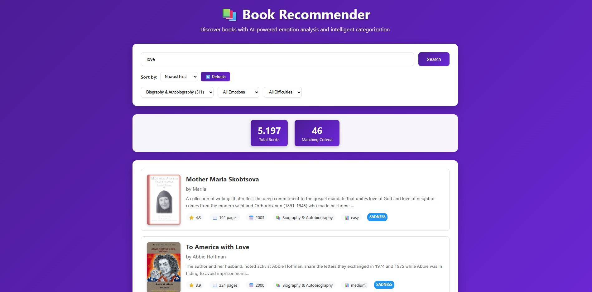

# Book Recommender with AI-Powered Emotion Analysis

A modern web application that provides intelligent book recommendations using semantic search, emotion analysis, and text classification powered by Large Language Models (LLMs).

> **Note**: This repository builds on the ideas from the [llm-semantic-book-recommender](https://github.com/t-redactyl/llm-semantic-book-recommender) project.

## Features

- **Semantic Search**: Find books using natural language queries (e.g., "books about children learning")
- **Emotion Analysis**: Discover books by emotional tone (joy, sadness, anger, fear, etc.)
- **Smart Categorization**: Filter books by Fiction/Nonfiction categories
- **Reading Difficulty**: Books categorized by reading complexity
- **Modern Web Interface**: Beautiful dark purple-themed responsive design
- **Comprehensive Data**: 5,000+ books with enhanced metadata

## Interface Preview



*Modern dark purple-themed web interface with semantic search and emotion-based filtering*

## Quick Start

### Prerequisites
- Python 3.8 or higher
- Internet connection for downloading book data

### Installation

1. **Clone the repository**:
   ```bash
   git clone <repository-url>
   cd Book_Recommender_LLM
   ```

2. **Install dependencies**:
   ```bash
   pip install -r requirements.txt
   ```

3. **Run the complete data pipeline**:
   ```bash
   python complete_pipeline.py
   ```
   This will:
   - Download book data from Kaggle
   - Clean and preprocess the data
   - Perform emotion analysis and text classification
   - Generate enhanced book dataset

4. **Start the web application**:
   ```bash
   python app.py
   ```

5. **Open your browser** and visit: `http://localhost:5000`

## Data Processing Pipeline

The project includes a comprehensive data processing pipeline that transforms raw book data into an enhanced dataset:

### Step 0: Data Download
- Downloads book data from Kaggle automatically
- Handles missing data gracefully

### Step 1: Data Cleaning
- Filters books with missing descriptions
- Removes books with insufficient metadata
- Creates enhanced title and description fields

### Step 2: Text Classification
- Uses BART-large-MNLI for zero-shot classification
- Categorizes books as Fiction/Nonfiction
- Generates confidence scores

### Step 3: Emotion Analysis
- Analyzes book descriptions for emotional content
- Extracts 7 emotion categories (joy, sadness, anger, fear, surprise, disgust, neutral)
- Calculates emotion intensity and diversity scores

### Step 4: Enhanced Features
- Reading difficulty assessment
- Book age calculation
- Popularity and recency indicators
- Comprehensive metadata generation

## Web Interface

The Flask-based web application provides a modern, intuitive interface for discovering books:

### Main Features
- **Search Functionality**: Semantic search with TF-IDF and fallback text matching
- **Filter Options**: Category, emotion, and difficulty filters
- **Book Cards**: Rich book information with covers, ratings, and metadata
- **Responsive Design**: Works on desktop and mobile devices
- **Dark Purple Theme**: Modern, elegant visual design

### Interface Overview


#### Search Interface
- **Search Bar**: Natural language queries (e.g., "books about children", "mystery novels")
- **Real-time Results**: Instant search results with relevance scoring
- **Smart Matching**: Finds books by title, author, description, and categories

#### Filter System
- **Emotion Filter**:
  - Joy (happy, uplifting books)
  - Sadness (emotional, touching stories)
  - Anger (intense, dramatic content)
  - Fear (suspenseful, thrilling books)
  - Surprise (unexpected plot twists)
  - Disgust (dark, disturbing themes)
  - Neutral (balanced emotional tone)
- **Difficulty Filter**:
  - Easy (simple language, short books)
  - Medium (moderate complexity)
  - Hard (complex language, long books)

#### Book Cards Display
Each book card shows:
- **Cover Image**: Book thumbnail or default purple placeholder
- **Title**: Full book title
- **Author**: Author name(s)
- **Description**: First 200 characters of book description
- **Metadata**:
  - ⭐ Average rating (0.0-5.0)
  - 📖 Number of pages
  - 📅 Publication year
  - 📚 Category (Fiction/Nonfiction)
  - 📊 Reading difficulty
  - [Emotion] Dominant emotional tone

#### Visual Design
- **Color Scheme**: Dark purple gradient background (#4C1D95 → #5B21B6 → #6D28D9)
- **Typography**: Clean, modern fonts (Segoe UI)
- **Layout**: Card-based design with hover effects
- **Responsive**: Adapts to different screen sizes
- **Accessibility**: High contrast colors and clear typography

### Mobile Experience
The interface is fully responsive and provides an optimal experience on:
- Desktop computers (1200px+ width)
- Tablets (768px-1199px width)
- Mobile phones (320px-767px width)

On mobile devices, the layout automatically adjusts:
- Single-column book cards
- Stacked filter options
- Touch-friendly buttons and inputs
- Optimized text sizing

## Project Structure

```
book_recommender/
├── app.py                          # Flask web application
├── templates/
│   └── index.html                  # Web interface template
├── complete_pipeline.py            # Complete data processing pipeline
├── create_web_interface.py         # Web interface generator
├── requirements.txt                # Python dependencies
├── books.csv                       # Raw book data (downloaded)
├── books_cleaned.csv               # Cleaned book data
├── books_with_categories.csv       # Books with classifications
├── books_with_emotions.csv         # Final enhanced dataset
└── README.md                       # This file
```

## API Endpoints

The web application provides several REST API endpoints:

- `GET /` - Main web interface
- `POST /api/search` - Search for books
- `GET /api/categories` - Get available categories and emotions
- `GET /api/trending` - Get trending books
- `GET /api/recent` - Get recently published books
- `GET /api/random` - Get random book recommendations

## Usage Examples

### Search Queries
- "books about children" - Find children's books
- "mystery novels" - Discover mystery books
- "sad stories" - Books with emotional content
- "easy reading" - Books with low difficulty

### Filtering
- **Categories**: Fiction, Nonfiction, etc.
- **Emotions**: Joy, Sadness, Anger, Fear, Surprise, Disgust, Neutral
- **Difficulty**: Easy, Medium, Hard

## Technical Details

### Technologies Used
- **Backend**: Flask (Python web framework)
- **Frontend**: HTML5, CSS3, JavaScript
- **Data Processing**: Pandas, NumPy
- **ML Models**: Transformers (BART-large-MNLI, RoBERTa)
- **Search**: TF-IDF vectorization with cosine similarity
- **Data Source**: Kaggle book dataset

### Performance Features
- **Caching**: Intermediate results cached for faster processing
- **Optimized Search**: Dual search strategy (TF-IDF + fallback)
- **Error Handling**: Robust error handling and fallback mechanisms
- **Data Validation**: Comprehensive data quality checks

## Data Statistics

- **Total Books**: 5,197 books with complete metadata
- **Categories**: 4 main categories (Fiction, Nonfiction, etc.)
- **Emotions**: 7 emotion categories analyzed
- **Languages**: Primarily English books
- **Time Range**: Books from various publication years

## Contributing

This project is designed for educational purposes and demonstrates modern web application development with AI/ML integration. Feel free to explore the code and adapt it for your own projects.

---

**Note**: This project demonstrates the integration of modern web technologies with AI/ML capabilities for creating intelligent recommendation systems. The complete pipeline showcases data processing, machine learning, and web development best practices.
